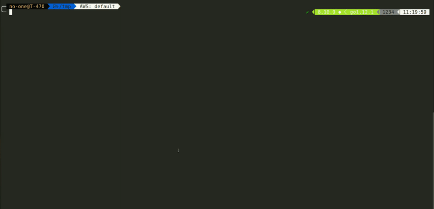

# cognito-go-auth [](https://travis-ci.org/nordcloud/cognito-go-auth) [](https://goreportcard.com/report/github.com/nordcloud/cognito-go-auth)

Cognito-go-auth is the golang library that allows you to easily generate Cognito Authentication Token and sign requests. Currently it supports only **Google federated authentication** using Cognito hosted UI.




### How it works?

- It creates HTTP server on the localhost:3000 and serves HTML page with the Cognito hosted UI.
- It creates websocket on localhost:3001 used to communicate with the web browser.
- It automatically opens web browser.
- When user authenticate using Google account, JS script sends the Authenticated Token to the websocket.

### Installation

```
go get github.com/nordcloud/cognito-go-auth
```

### Use source code to sign request in your application

The main use case for this library is to use the CognitoAuthorizer from the `auth` package to sign requests in your command line application.

To create cognito authorizer you can either use `NewCongitoAuthorizer` function:

```
authorizer := NewCongitoAuthorizer(
    cognitoUserPoolId, cognitoClientId, cognitoHostedUI
)
```

or create it using settings from the environment variables:

```
authorizer, err := auth.GetAuthorizerFromEnv(userPoolID, clientID, hostedUIDomain)
```

To generate cognito Authorization token you have to execute:

```
token, err := authorizer.GetToken()
```

Signing requests is possible using the token.Sign(request) method. Please not that you can also manually sign request by adding `Authorization` header.

You can check `main.go` file for the example implementation of the CURL tool.


### Use as a standalone cognito signed CURL

Usage: `cognito-go-auth [flags] request_url`

Flags:

- `-c`, `--client-id`           AWS cognito Client ID
- `-H`, `--header`              Request header 'HeaderName: HeaderValue'
- `-u`, `--hosted-ui`           Addres of the hosted UI
- `-X`, `--request`             Request method (default "GET")
- `-p`, `--user-pool-id`        AWS cognito user pool ID
- `-v`, `--verbose`             Show response status and headers

You can also use environment variables to store cognito configuration:

- `USER_POOL_ID` AWS cognito user pool ID
- `CLIENT_ID` AWS cognito Client ID
- `HOSTED_UI` Addres of the hosted UI

Example:

```
cognito-go-auth -H "Header1: Header1Value" -X POST https://api.application.nordcloudapp.com
```

